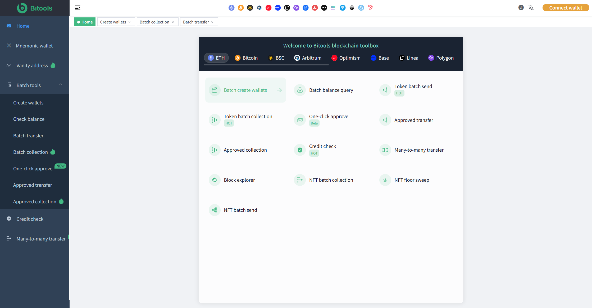
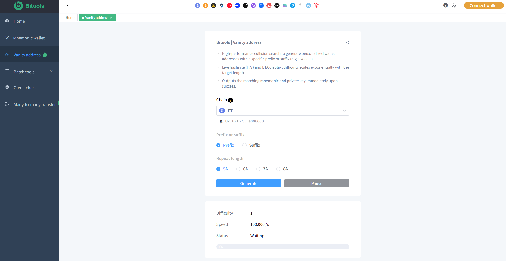
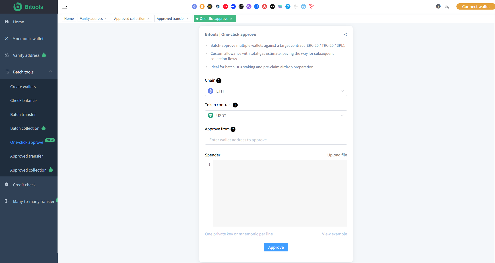

# ETH Tools

**A collection of practical Ethereum (ETH) tools for Web3 users, developers and wallet operators.**

[](LICENSE)
[](https://ethereum.org)
[](https://www.typescriptlang.org/)

---

## 📖 Overview

**Bitools ETH Tools** is designed to solve the most common and time-consuming pain points in Ethereum wallet and asset management.

Whether you manage dozens or thousands of wallets, Bitools helps you complete high-frequency operations quickly and securely:

- Batch create wallets
- Batch transfer
- Batch balance checking
- Wallet sweeping (collection)
- Authorization detection & revoke
- Multisig wallet management
- Vanity (custom) wallet generation
- Multi-chain asset management

Focus on efficiency, security and simplicity — manage ETH and ERC20 assets without repetitive manual work.

---

## ✨ Features — Solving Real User Pain Points

- 🔑 **Batch Create Wallets** — Quickly generate hundreds of Ethereum wallets in seconds (`ETH钱包批量生成` / `batch wallet generator`)
- 💸 **Batch Transfer** — Send ETH or ERC20 tokens (USDT, USDC etc.) to multiple addresses at once
- 📊 **Batch Balance Checker** — Instantly check ETH + ERC20 balances across all your wallets
- 🧹 **Wallet Sweeping (归集)** — Automatically collect assets from multiple wallets into one main wallet
- 🔍 **Authorization Detection** — Detect risky token approvals and revoke them (`USDT授权检测` / `revoke token approval`)
- 👥 **Multisig Wallet** — Create and manage Ethereum multi-signature wallets for higher security
- ✨ **Vanity Wallet (靓号)** — Generate customized Ethereum addresses with preferred prefix/suffix
- 🌐 **Multi-Chain Asset Management** — Unified experience across Ethereum, BNB, Base, Arbitrum, Solana, TRON etc.

---

## 📸 Screenshots

<div align="center">
  
  <br/>
  <em>Main Dashboard</em>
</div>

<br/>

| Wallet Tools | Bulk Operations |
|--------------|-----------------|
|  |  |

---

## 🛠️ Core Tools

### Wallet Management
- Batch Wallet Generator
- Vanity Address Generator (靓号)
- Multi Wallet Manager

### Transfer & Collection
- ETH / ERC20 Bulk Transfer
- Wallet Sweeper / Auto Collection (批量归集)
- Multi-wallet Asset Consolidation

### Balance & Monitoring
- Batch Balance Checker
- ETH + USDT / USDC Balance Inquiry
- Real-time Asset Overview

### Security
- Authorization Detection & Revoke
- Token Approval Scanner
- Transaction Risk Checking

### Advanced
- Ethereum Multisig Wallet
- Multi-signature Transaction Management
- Multi-chain Asset Dashboard

---

## Detailed Features

### Batch Create Wallets
Tired of creating wallets one by one? Generate dozens or hundreds of Ethereum wallets instantly.  
**Keywords**: ETH钱包批量生成 · 批量创建钱包地址 · bulk wallet generator · batch crypto wallet creator

### Batch Transfer
Send ETH or USDT to multiple addresses in a single operation — perfect for airdrops, payments or team distribution.

### Batch Balance Checker
Check all your wallets’ ETH and ERC20 balances at once. No more switching addresses manually.

### Wallet Sweeping (归集)
Automatically gather funds from multiple wallets into your main wallet, making asset management clean and efficient.

### Authorization Detection
Detect and manage token approvals to reduce security risks.  
Support for `USDT授权查询` · `钱包授权取消` · `revoke token approval`.

### Multisig Wallet
Create and operate multi-signature wallets for enhanced asset protection.

### Vanity Wallet (靓号)
Generate customized Ethereum addresses that match your brand or personal preference.

### Multi-Chain Asset Management
Manage assets across Ethereum and other major chains in one unified toolbox.

---

## Learn More

All tools are available at:

**[https://bitools.pro](https://bitools.pro)**

---

## Documentation

- [ETH Wallet](docs/eth-wallet.md)
- [ETH Bulk Transfer](docs/eth-bulk-transfer.md)
- [ETH Balance](docs/eth-balance.md)
- [ETH Wallet Sweeper](docs/eth-wallet-sweeper.md)
- [Authorization Detection](docs/authorization-detection.md)
- [ETH Multisig](docs/eth-multisig.md)
- [Vanity Address](docs/eth-vanity-address.md)
- [ERC20 Token](docs/erc20-token.md)

---

## Related Tools

- [Solana Tools](https://github.com/xBitools/solana-tools)
- [TRX Tools](https://github.com/xBitools/trx-tools)
- [BNB Tools](https://github.com/xBitools/bnb-tools)
- [Base Tools](https://github.com/xBitools/base-tools)
- [Arbitrum Tools](https://github.com/xBitools/arb-tools)

---

## Contributing

Contributions, bug reports and suggestions are welcome.  
Please open an issue before making major changes.

---

## 📦 Installation

```bash
# Clone the repository
git clone https://github.com/xBitools/eth-tools.git

cd eth-tools

# Install dependencies
npm install
# or
pnpm install
# or
yarn
